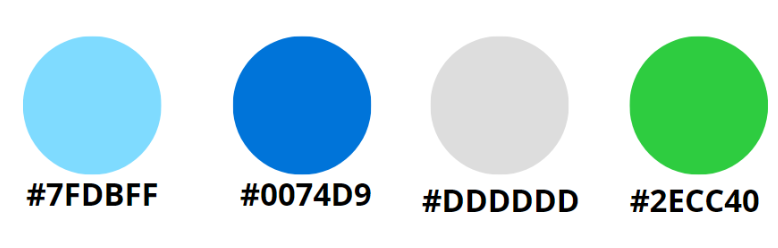
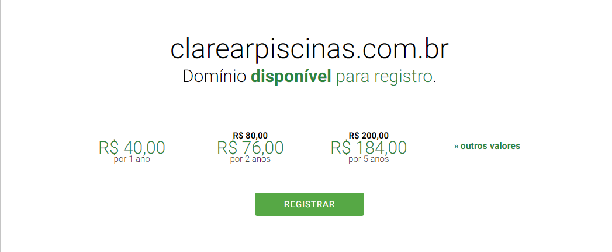

# Dados
1799771-7693

https://www.instagram.com/marcelopiscinas24/

https://w.app/3BDfwk

```HTML
<a href="https://wa.me/5517997717693?text=Olá!%20Gostaria%20de%20mais%20informações%20sobre%20os%20serviços%20de%20limpeza%20e%20manutenção%20de%20piscinas%20da%20Clarear%20Piscinas." target="_blank" class="botaoPadrao botaoPadraoWhatsapp">
    <i class="fa fa-whatsapp"></i> Fale Conosco no WhatsApp
</a>
```

title="Na Clarear Piscinas, oferecemos soluções completas e personalizadas que mantêm sua piscina cristalina e segura o ano todo."


## Nome sugerido: Clarear Piscinas

Esse nome é fácil de lembrar, tem relação direta com o serviço, e usa um termo comum em buscas ("clarear", associado a limpeza) além de "piscinas", o que é relevante para SEO. 
O uso da palavra "clarear" pode atrair buscas relacionadas à clareza e limpeza da água da piscina, além de ser um termo positivo e visual.

# Paleta de Cores
Sugiro uma paleta de cores que transmita frescor, limpeza, e confiança, associadas à água e à natureza do serviço. 

1. **Azul Claro (#7FDBFF)** - Transmite frescor e limpeza, remetendo diretamente à água da piscina.
   
2. **Azul Profundo (#0074D9)** - Representa confiança, estabilidade e eficiência, além de criar contraste com o azul claro.

3. **Branco (#FFFFFF)** - Associado à pureza e clareza, dando uma sensação de limpeza absoluta.

4. **Cinza Claro (#DDDDDD)** - Para elementos de fundo ou texto secundário, criando uma sensação de sofisticação e elegância.

5. **Verde Menta (#2ECC40)** - Um toque de natureza e vitalidade, sugerindo um ambiente limpo e saudável.




---
# Fonte Poppins 

Estilo: Moderna, limpa, com formas arredondadas que dão uma sensação de suavidade e clareza.
Por que escolher: As letras arredondadas transmitem simplicidade e frescor, alinhando-se com a ideia de água e limpeza.

HTML
```
<link rel="preconnect" href="https://fonts.googleapis.com">
<link rel="preconnect" href="https://fonts.gstatic.com" crossorigin>
<link href="https://fonts.googleapis.com/css2?family=Poppins:ital,wght@0,100;0,200;0,300;0,400;0,500;0,600;0,700;0,800;0,900;1,100;1,200;1,300;1,400;1,500;1,600;1,700;1,800;1,900&display=swap" rel="stylesheet">
```

CSS
```Google Fonts
@import url('https://fonts.googleapis.com/css2?family=Poppins:ital,wght@0,100;0,200;0,300;0,400;0,500;0,600;0,700;0,800;0,900;1,100;1,200;1,300;1,400;1,500;1,600;1,700;1,800;1,900&display=swap');
```
---
> A palavra "Clarear" pode ser em azul profundo (#0074D9), enquanto "Piscinas" em azul claro (#7FDBFF), para dar contraste e destacar o nome.

---
# Referências

### Conconrrentes
https://tropadapiscina.com.br/
https://www.jcspiscinas.com.br/
https://www.limpapiscinas.com.br/
https://piscinafacil.com.br/limpeza-de-piscina/

### Theme Forest
[Referências](https://themeforest.net/search/pool%20cleaning?srsltid=AfmBOorahjBb7jlTOFlsCzlKKmKtyuBLyH18u3Mbav53vBqUGaRSCt46)

[](https://themeholy.com/wordpress/poolax/home1-onepage/)

## Domínio disponível:  www.clarearpiscinas.com.br

